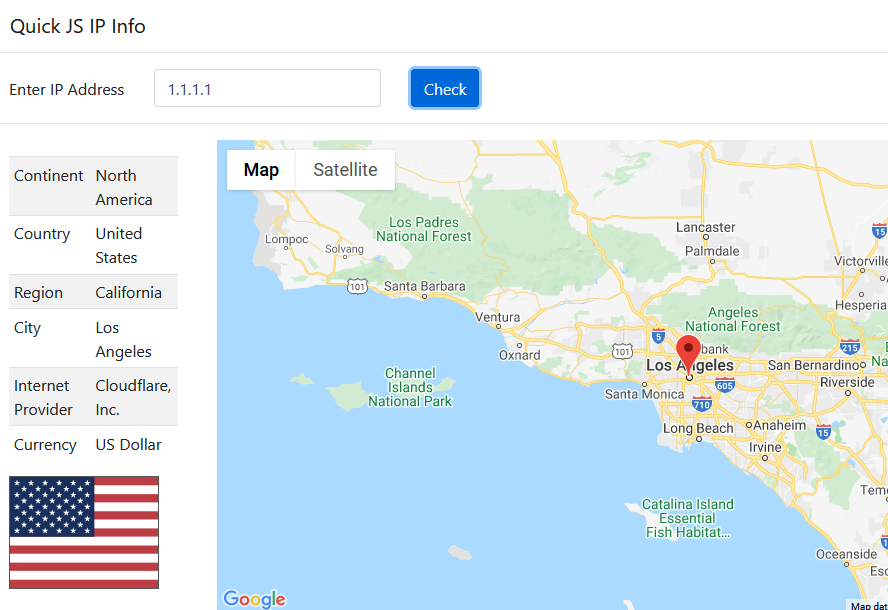

Quick JS application for search by IP address.



# How to run
```
git clone https://github.com/miptleha/quick-js-ip-info.git
cd quick-js-ip-info
npm it
```

Or put `index.html`, `script.js`, `index.css` on your web server (it is client JS application).
